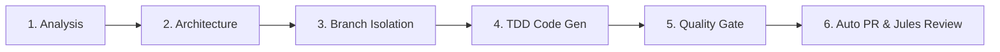

# Git Workflow & 6-Stage Automated Lifecycle Rule

## Rule: Strict Branch Isolation & Automatic PR Lifecycle

All development on `card-collectionJava` must adhere to the 6-stage lifecycle protocol:



### 1. Branch Isolation (`main` Protection)
- **Invariant:** Antigravity must **NEVER** edit files or commit directly to `main`.
- Always initialize or check out a dedicated feature, fix, or chore branch (`feature/*`, `fix/*`, `chore/*`).

### 2. Local Quality Gate Verification (Pre-Commit)
Before staging or committing any code, execute the local quality gate:
```bash
# 1. Spotless formatting
mvn spotless:check

# 2. JUnit 5 test suite with Java 26 preview features
mvn clean test

# 3. Local pipeline dry-run
mvn exec:java@local
```

### 3. Stage & Semantic Commit
- Stage modified source, test, resource, and agent configuration files.
- Commit using semantic commit messages adhering to Conventional Commits:
  - `feat(...)`: New pipeline features, generators, or template enhancements.
  - `fix(...)`: Bug fixes in generators, schema, image conversion, or compression.
  - `perf(...)`: Core Web Vitals, compression, or execution speed optimizations.
  - `chore(...)`: Agent governance, CI workflows, dependency upgrades.
  - `test(...)`: Unit, snapshot, or contract test additions.

### 4. Push & Autonomous PR Creation
- Push the branch to `origin`:
  ```bash
  git push -u origin <branch-name>
  ```
- Automatically open a Pull Request against `main` via `gh pr create` with the `.github/pull_request_template.md` checklist:
  ```bash
  gh pr create --base main --head $(git branch --show-current) --fill
  ```
- Pushing also triggers `.github/workflows/auto-pr.yml` on GitHub for automated Jules CI review.
- **Never stop before opening the PR:** The workflow must complete with the PR opened and reported to the user.
