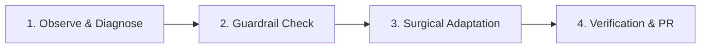

# Recursive Self-Improvement & Continuous Calibration Skill

Use this skill to execute the recursive self-improvement loop: autonomously assessing agent performance, reflecting on friction or user corrections, aligning configuration with core project goals, and keeping rules and skills continuously tuned.

## 1. Trigger Conditions

Execute this loop when:
1. **User Correction / Feedback:** The user corrects an assumption, provides workflow guidance, or triggers `/learn`.
2. **Post-Task Friction:** A command or test failed due to missing context, an outdated rule, or suboptimal tool choice.
3. **Project Goal Evolution:** New architecture choices (e.g. Java 27 preview features, virtual threads, CWV targets, AVIF engine) require updated guardrails.
4. **Scheduled Self-Audit:** A scheduled periodic heartbeat (via `schedule` cron or timer) triggers an automated sanity audit.

---

## 2. Invariant Guardrails (Hard Limits)

Recursive self-improvement must **never** weaken system invariants:
- **Never bypass branch protection:** Never edit or commit directly on `main`. Work on `feat/*` or `chore/*`.
- **Never weaken data isolation:** Never embed or read raw `cards.json` (770 KB) or `market-data-cache.json` in full.
- **Never downgrade runtime:** Keep Java 27 Preview (`--enable-preview`) and Virtual Threads intact.
- **Token budget preservation:** Keep [`AGENTS.md`](../../AGENTS.md) strictly $\le 60$ lines ($\le 500$ tokens).

---

## 3. Four-Stage Recursive Execution Cycle



### Stage 1: Observe & Diagnose
- Analyze the friction point:
  - Did the agent suggest outdated commands or obsolete dependencies?
  - Did a tool call generate unbounded token output or fail unnecessarily?
  - Did the user have to intervene to enforce a convention?
- Formulate the exact delta: What concise rule, tip, or skill would have prevented this?

### Stage 2: Guardrail & Budget Check
- Check if the rule belongs in:
  - **`AGENTS.md`**: Only if it is a system-wide core invariant (1 line, ensure total file $\le 60$ lines).
  - **`.agents/rules/<domain>.md`**: Domain-specific guidance (e.g. Java standards, compression, token efficiency).
  - **`.agents/skills/<skill-name>/SKILL.md`**: Procedural runbooks or step-by-step troubleshooting.

### Stage 3: Surgical Adaptation
- Apply minimal, surgical diffs (`replace_file_content`).
- Avoid rule bloat: Remove obsolete instructions when adding newer, more effective ones.
- Keep skill frontmatter YAML metadata concise (description $\le 50$ tokens) for fast progressive loading.

### Stage 4: Verification & PR Lifecycle
- Validate any edited markdown files.
- Run `mvn test-compile` or `mvn spotless:check` if code standards or configs were touched.
- Stage only modified `.agents/` files:
  ```bash
  git checkout -b chore/agent-self-improvement
  git add .agents/
  git commit -m "chore(agent): recursively refine self-improvement guidelines"
  git push -u origin chore/agent-self-improvement
  gh pr create --fill
  ```

---

## 4. Scheduled Self-Audit Runbook

To configure recurring self-audits, agents or users can set a cron task using the `schedule` tool:
- **Weekly Audit Trigger:** `CronExpression="0 9 * * 1"`, Prompt="Run recursive self-improvement audit on .agents/ rules, check token budget against AGENTS.md, and ensure alignment with project targets."
