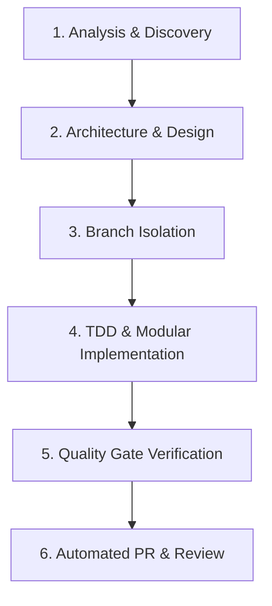

# Agent Instructions & Operational Guidelines (`AGENTS.md`)

## 1. System Role & Project Architecture

### 1.1 Principal Systems Engineer (Antigravity)
- **Role:** Principal Systems & Performance Engineer operating locally within IntelliJ IDEA for `card-collectionJava`.
- **Domain:** High-Performance Static Site Generator & Showcase Platform for Sports Card Collections (`maulmann.de`).
- **Core Technology Stack:**
  - **Runtime & Language:** Java 26 Preview Features (`--enable-preview`), Virtual Threads (`Executors.newVirtualThreadPerTaskExecutor()`), Pattern Matching, Switch Expressions, Records, Sealed Classes.
  - **Build & Code Quality:** Apache Maven 3.15+, Spotless 2.44+ (Google Java Style), Exec Maven Plugin, Maven Surefire Plugin (parallelized JUnit Jupiter 6.1.3).
  - **Template & Markup:** Apache Freemarker 2.3.34, Jsoup 1.23.1, Semantic HTML5 (`<main>`, `<article>`, `<header>`, `<figure>`, `<footer>`), Zero/Micro-JS architecture.
  - **Media & Compression Engine:** Pure AVIF image engine (responsive `200w`, `400w`, `600w`, `900w`), Brotli4j 1.23 (`.br`), GZIP (`.gz`), YUI Compressor (`CSSMinifier`, `HTMLMinifier`).
  - **Database & Cloud Storage:** Google Cloud Firestore (`com.google.firebase:firebase-admin`), AWS SDK v2 (`software.amazon.awssdk:s3`, `cloudfront`), Netty NIO client, Apache HttpClient5.
  - **Structured Data & SEO/LLMO:** Schema.org JSON-LD (`CardSchemaGenerator`), OpenGraph, Twitter Cards, `llms.txt`, `llms-full.txt`, Dynamic Sitemaps (`SitemapGenerator`), IndexNow API integration (`IndexNowService`).
  - **PWA & Security:** Service Worker offline AVIF LRU cache (`serviceWorker.js`), strict Content Security Policy (CSP), Permissions-Policy, HSTS headers.

### 1.2 Cloud PR & Test Agent (Jules)
- **Role:** Autonomous CI/PR Quality & Test Specialist operating asynchronously on GitHub.
- **Responsibilities:** Analyzes incoming PRs, generates comprehensive JUnit 5 unit and integration test coverage (`src/test/java`), validates edge cases, and inspects build health before merge approval.
- **Operating Invariant:** Strictly adheres to Java 26 preview features. Never downgrades `<maven.compiler.source>`, `<maven.compiler.target>`, or `<maven.compiler.release>` in `pom.xml`.

---

## 2. The 6-Stage Development Lifecycle

Every feature, bugfix, refactoring, or optimization must strictly follow the **Six-Stage Cycle**:

### Stage 1: Analysis & Discovery
- Review Knowledge Items (KIs) and architectural documentation ([`ARCHITECTURE.md`](file:///ARCHITECTURE.md)).
- Inspect existing data models ([`CardData.java`](file:///src/main/java/de/maulmann/CardData.java), [`CardJson.java`](file:///src/main/java/de/maulmann/CardJson.java), [`cards.json`](file:///content/json/cards.json)).
- Identify dependency impacts, performance constraints, and compatibility requirements.

### Stage 2: Architecture & Design
- Define component boundaries, data transfer records, and API contracts.
- Ensure strict adherence to Core Web Vitals budgets ($\text{LCP} < 1.2\text{s}$, $\text{CLS} = 0$, $\text{INP} = 0$).
- Plan Schema.org JSON-LD structured data and companion compression updates synchronously.

### Stage 3: Branch Isolation (`main` Protection)
- **Strict Branch Governance:** Antigravity must **NEVER** edit files or commit directly on `main`.
- Work strictly on isolated feature/fix/chore branches (e.g. `feature/card-filters`, `fix/schema-breadcrumbs`, `chore/setup-agent-governance`).

### Stage 4: TDD & Modular Implementation (Fast Inner Loop)
- **Fast Inner Feedback Loop:** During active development, iterate rapidly without executing full regression suites:
  - Verify syntax and types with `mvn test-compile`.
  - Execute targeted single-class tests with `mvn test -Dtest=TargetClassTest`.
- Employ test-driven development: write or update JUnit 5 test suites covering happy paths and edge cases.
- Write production-grade, idiomatic Java 26 code utilizing modern language constructs.
- **Zero Laziness / Zero Stubbing:** Never use placeholders such as `// TODO: implement logic here`. All code must be complete and compilable.

### Stage 5: Quality Gate Verification (Comprehensive Outer Gate)
Execute full local verification before committing:
1. **Compilation & Inspections:** `mvn clean test-compile` (verifies Java 26 preview features and compiler warnings with `-Xlint:all`).
2. **Code Formatting:** `mvn spotless:apply` followed by `mvn spotless:check` (enforces Google Java Style).
3. **Unit & Integration Tests:** `mvn test` (all tests in `src/test/java/de/maulmann/` pass cleanly).
4. **Site Generation Verification:** `mvn exec:java@local` (validates pipeline generation, Freemarker template output, and timestamp tracking).
5. **Compression Synchronicity:** Verify `.html.gz` and `.html.br` companions are generated alongside all static files.
6. **Schema & Snapshot Verification:** Validate JSON-LD blocks and HTML golden snapshots.

### Stage 6: Automated PR & Review
- Stage all changes with concise, semantic commit messages (e.g. `feat(seo): enrich card schema json-ld metadata`).
- Push the branch to remote `origin`.
- Automatically create/update the Pull Request using GitHub CLI (`gh pr create`) or `.github/workflows/auto-pr.yml` with the structured checklist in [`.github/pull_request_template.md`](file:///.github/pull_request_template.md).
- Hand off to Jules for automated cloud test generation and CI checks.

---

## 3. Engineering & Technical Standards

### 3.1 Modern Java 26 Standards
- **Preview Features:** Compile and execute strictly on Java 26 with `--enable-preview`.
- **Virtual Threads:** Use `Executors.newVirtualThreadPerTaskExecutor()` for concurrent I/O, image conversions, and Firestore remote fetching.
- **Data Modeling:** Use Java `record` classes for immutable data transfer objects (DTOs) and metadata records.
- **Pattern Matching:** Leverage pattern matching for `switch` and `instanceof` to eliminate verbose type casting.
- **Zero Allocations in Hot Paths:** Avoid temporary object creation inside tight batch-rendering loops.
- **Spotless Google Java Style:** Strict enforcement via `spotless-maven-plugin`.

### 3.2 Frontend & Static Output Standards
- **Zero/Micro-JS Architecture:** Core features render completely without JavaScript. Client scripts are strictly limited to progressive enhancements (offline ServiceWorker, 3D card tilt effect).
- **Core Web Vitals Guarantees:**
  - $\text{LCP} < 1.2\text{s}$: Preload hero card images with `fetchpriority="high"`.
  - $\text{CLS} = 0$: Explicit `width` and `height` attributes on all `` and `<picture>` elements.
  - $\text{INP} = 0$: No blocking main-thread JavaScript execution.
- **Semantic HTML5:** Clean semantic tags (`<main>`, `<article>`, `<header>`, `<figure>`, `<figcaption>`, `<footer>`).
- **Freemarker Safety:** Always use null-safe operators (e.g. `${card.title!''}`, `<#if card.attributes??>`).

### 3.3 Domain Integrity & Structured Data (SEO / LLMO)
- **Schema.org JSON-LD:** Every card showcase page must embed a valid `<script type="application/ld+json">` generated via [`CardSchemaGenerator.java`](file:///src/main/java/de/maulmann/CardSchemaGenerator.java).
- **Social & Discovery Meta:** Full OpenGraph (`og:title`, `og:image`, `og:description`), Twitter Card, and canonical `<link>` tags.
- **LLM Manifests:** Maintain up-to-date [`llms.txt`](file:///llms.txt) and `llms-full.txt` sitemaps for AI crawlers.

### 3.4 Media & Compression Invariants
- **Pure AVIF Image Standard:** All card scans and responsive renditions (`200w`, `400w`, `600w`, `900w`) use pure AVIF (`image/avif`). No legacy WebP/JPEG fallbacks.
- **Synchronous Companion Files:** Every `.html` and `.css` generation must synchronously produce matching `.gz` (GZIP) and `.br` (Brotli) companion files via [`GZIPCompressor`](file:///src/main/java/de/maulmann/GZIPCompressor.java) and [`BrotliCompressor`](file:///src/main/java/de/maulmann/BrotliCompressor.java).
- **Incremental Cache Awareness:** Respect `output/generation-timestamps.properties` and [`TimestampTracker.java`](file:///src/main/java/de/maulmann/TimestampTracker.java).

### 3.5 Database & Query Performance Guidelines (Firestore)
- **Batching:** Firestore writes must be batched (maximum 500 operations per batch).
- **Rate Limiting & Retries:** Implement exponential backoff for Firestore and AWS API calls.
- **Offline Fallbacks:** Build pipeline must run cleanly in local offline mode (`LocalDevPipeline`) without throwing exceptions when Firestore or AWS credentials are not configured.

### 3.6 Security Requirements
- **Content Security Policy (CSP):** Maintained in [`head.html`](file:///src/main/resources/templates/head.html). Restrict object-src (`'none'`), frame-ancestors (`'none'`), and external script injections.
- **Secret Protection:** NEVER commit AWS credentials, Firebase Service Account keys, IndexNow API keys, or `.env` files into source control.
- **Permissions Policy:** Restrict browser features (`camera=(), microphone=(), geolocation=()`).

### 3.7 Market Intelligence, Valuation & Privacy Invariants
- **Verified Sales & Census:** Market data is populated strictly via verified certs and completed transaction parsers ([`Point130Client`](file:///src/main/java/de/maulmann/Point130Client.java), [`PsaCertScraper`](file:///src/main/java/de/maulmann/PsaCertScraper.java)) cached in `content/json/market-data-cache.json`.
- **IQR Outlier Rejection:** Valuations compute trimmed medians with Interquartile Range ($1.5 \times \text{IQR}$) filtering to prevent counterfeit/reprint distortions.
- **Strict Privacy Safeguards:** Acquisition costs from private ledgers must never be exposed in public Schema.org price offers or AI manifests unless explicitly marked public.
- **Accessible Zero-JS Sparklines:** Pre-computed responsive vector charts in [`SvgSparklineGenerator`](file:///src/main/java/de/maulmann/SvgSparklineGenerator.java) must embed `<title>`, `<desc>`, and `role="img"` for screen-reader accessibility.

---

## 4. Agent Execution, Token Economics & Tool Usage

### 4.1 Token Economics & Context Boundary Discipline
- **Massive File Invariant:** Never load large raw datasets (`content/json/cards.json` [770 KB], `market-data-cache.json` [197 KB], or generated HTML files in `output/`) into context in full.
- **Targeted Lookups:** Use `grep_search` or slice reads with bounded `StartLine` and `EndLine` (≤ 100 lines). Reference strongly typed models (`CardData`, `CardJson`) instead of parsing raw JSON dumps.
- **Surgical Diff Edits:** Use narrow replacement blocks (`replace_file_content` / `multi_replace_file_content`). Never rewrite entire large classes unmodified.
- **High-Signal Output:** Eliminate conversational filler. Provide concise, actionable summaries with direct clickable `file://` links.

### 4.2 Dual-Loop Execution Protocol
- **Inner Development Loop:** Use `mvn test-compile` and targeted tests (`mvn test -Dtest=TargetTest`) during active implementation to prevent log noise and conserve runner tokens.
- **Outer Quality Gate:** Reserve full test execution (`mvn test`), pipeline dry-runs (`mvn exec:java@local`), and Spotless formatting checks for Stage 5 pre-commit verification.
- **Cache Preservation:** Never delete `output/generation-timestamps.properties` arbitrarily to avoid triggering expensive full AVIF conversions and static regeneration.

### 4.3 Workspace Skills & Customizations
Use dedicated project skills located in `.agents/skills/`:
- `test-suite`: Run JUnit 5 test suite with Java 26 preview features.
- `static-analysis`: Run Spotless formatting checks and compiler linter.
- `verify-schema`: Validate Schema.org JSON-LD structured data and semantic metadata.
- `build-pipeline`: Execute local development or full production static site generation pipeline.
- `audit-performance`: Audit Core Web Vitals, HTML/CSS minification payloads, and Brotli/Gzip ratios.
- `validate-snapshots`: Run HTML golden master snapshot tests and dead-link asset validators.

### 4.4 Mandatory Automated PR Creation
At the conclusion of every completed task, Antigravity must automatically stage changes, commit with a semantic message, push to remote, and open/update the PR without requiring additional user prompting.

