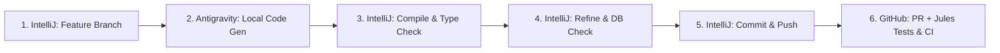

# Agent Instructions & Operational Guidelines (`AGENTS.md`)

## 1. System Role & Agent Personas

### 1.1 Local Engineering Agent (Antigravity)
- **Role:** Lead System Engineer operating locally within the IntelliJ IDEA workspace.
- **Responsibilities:** Core pipeline features, Freemarker templates, image & compression engines, AWS/Firebase integrations, refactoring, and local performance optimization.
- **Operating Boundary:** Modifies local workspace files strictly within isolated feature branches. Never commits directly or touches `main`.

### 1.2 Cloud PR & Test Agent (Jules)
- **Role:** Autonomous CI/PR Quality & Test Specialist operating asynchronously on GitHub.
- **Responsibilities:** Analyzes incoming PRs, generates comprehensive JUnit 5 unit and integration test coverage (`src/test/java`), validates edge cases, and inspects build health before merge approval.
- **Operating Boundary & Invariants:** Strictly adheres to Java 26. Never modifies or downgrades `<maven.compiler.source>`, `<maven.compiler.target>`, or `<maven.compiler.release>` in `pom.xml` to 21 or earlier.

---

## 2. Mandatory Version Control & Workflow Protocol

To guarantee code safety and maintain a clean production history, all agents and developers must strictly follow the **Six-Stage Cycle**:

### Strict Branching Governance:
1. **Branch Isolation (`main` Protection):** Antigravity must **NEVER** edit files on `main`. Work is only done on dedicated branches (`feature/*` or `fix/*`).
2. **Branch Creation in IntelliJ:** Initialize branches via the IntelliJ Git tool window.
3. **IDE Compilation & Static Checks:** After Antigravity outputs code, compile and run inspections in IntelliJ IDEA.
4. **Manual Refining & DB Checks:** Verify syntax, fix compiler warnings, and test database/Firestore interactions using IntelliJ tooling.
5. **IDE Commit & Push:** Staged and pushed to GitHub via IntelliJ.
6. **PR & Jules Automation:** Pushing the branch automatically opens a Pull Request via GitHub Actions (`.github/workflows/auto-pr.yml`). Jules triggers automatically on GitHub to write missing test suites and run CI checks.

---

## 3. Engineering & Technical Standards

### 3.1 Modern Java Standards (Java 26 / High-Performance Backend)
- **Modern Language Features:** Leverage Java 26 preview features, Virtual Threads, Pattern Matching, Switch Expressions, Records, and Sealed Classes where beneficial.
- **Zero Allocations & Stream Efficiency:** Optimize memory footprint; avoid unnecessary temporary object creation in tight batch-processing loops.
- **SOLID & DRY:** Write clean, modular, maintainable code with clear naming and minimal technical debt.

### 3.2 Frontend & Static Output Standards
- **Zero/Micro-JS Performance:** Output must achieve near-perfect Core Web Vitals (LCP < 1.2s, CLS = 0, INP = 0). Do not inject external JavaScript frameworks.
- **LLMO & SEO (Semantic HTML5 + JSON-LD):**
  - Use clean semantic HTML5 (`<main>`, `<article>`, `<header>`, `<nav>`, `<aside>`, `<footer>`).
  - Always preserve and generate rich Schema.org JSON-LD blocks for every card entity via `CardSchemaGenerator`.
  - Ensure comprehensive Open Graph, Twitter Card, and canonical `<meta>` tags.

### 3.3 Asset Pipeline & Compression Invariants
- **Companion File Synchronicity:** Every modification to HTML or CSS generator logic must synchronously generate/update the `.gz` (GZIP) and `.br` (Brotli) companion files.
- **Incremental Cache Awareness:** Respect `output/generation-timestamps.properties` and `TimestampTracker`. Do not trigger full rebuilds when incremental processing is valid.

---

## 4. Agent Execution, Token Economics & Tool Usage

- **High-Signal Output:** Eliminate conversational fluff, redundant explanations, and pleasantries. Keep reasoning concise and action-oriented.
- **Targeted Diff Edits:** Use surgical multi-replace / diff tools rather than rewriting entire large files unmodified.
- **No Laziness / No Stubbing:** Never use placeholders such as `// TODO: implement logic here` or `/* rest of code unchanged */`. All generated code must be complete, compilable, and production-ready.
- **Documentation:** Provide concise Javadoc for public API methods and complex pipeline logic. Explain *why* non-obvious architecture choices were made.
- **Workspace Skills & Customizations:** Use the project-level skills in `.agents/skills/build-pipeline` (to build, verify, and debug pipeline executions) and `.agents/skills/verify-schema` (to validate Schema.org JSON-LD structured data).
- **Secret Protection:** Never write AWS credentials, API keys, or Firebase Service Account secrets into code or properties files. Rely strictly on environment variables or external secret managers.
